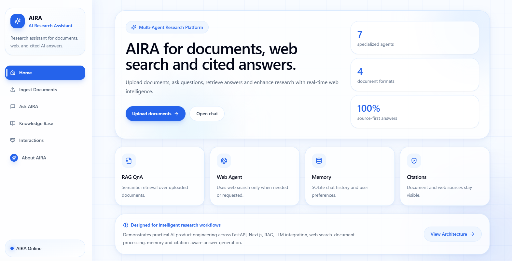
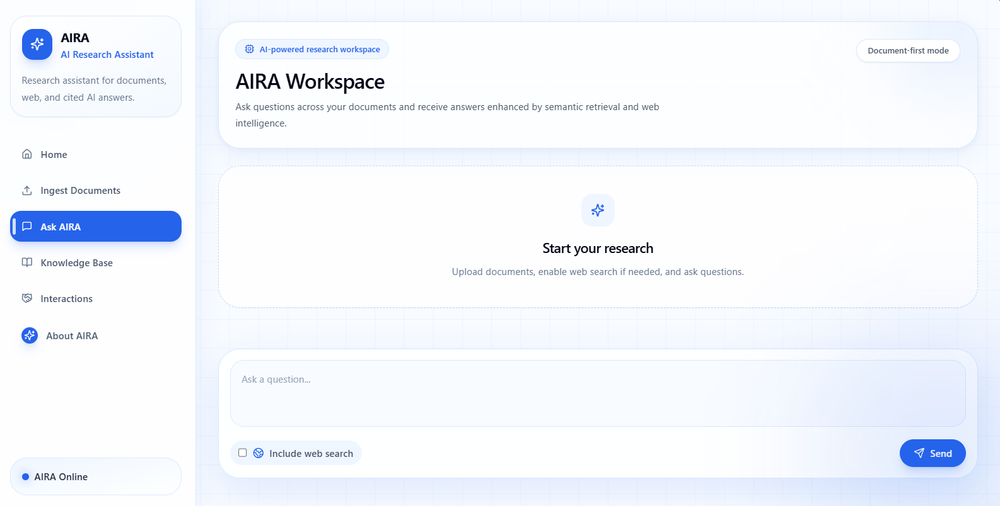
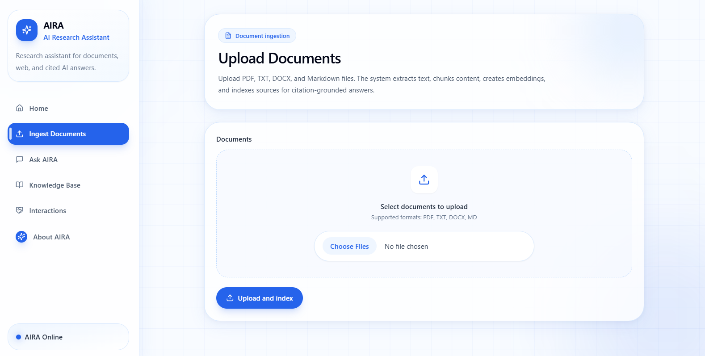
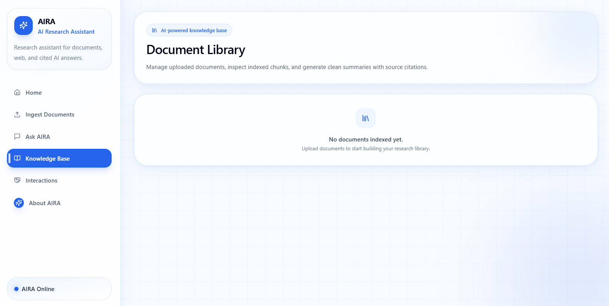
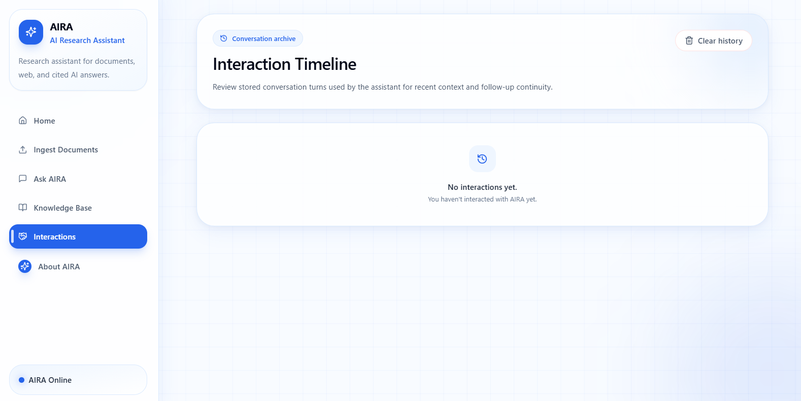
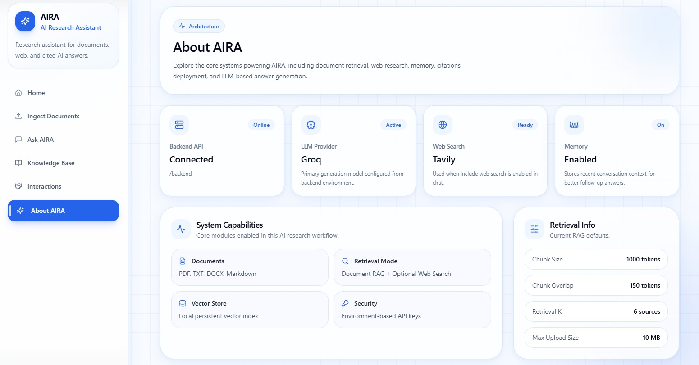

# 🧠 AI Research Assistant


A production-style full-stack Generative AI platform that combines Retrieval-Augmented Generation (RAG), multi-document reasoning, web research, semantic retrieval, memory systems, and citation-aware answer generation into a modern AI research workflow.

The platform enables users to upload research documents, retrieve semantic information, generate grounded answers with citations, summarize documents, and augment responses using live web search.

Built using FastAPI, Next.js, Groq LLMs, vector embeddings, semantic retrieval pipelines, and multi-agent orchestration.

```
 🔗 Live Demo

Frontend
https://ai-research-assistant-lime-five.vercel.app/

Backend API Docs
https://ai-research-assistant-backend-eoew.onrender.com/docs

```

# ✨ Key Highlights

✅ Multi-document Retrieval-Augmented Generation (RAG)  
✅ Citation-aware answer generation  
✅ Source-grounded responses from documents and web  
✅ Multi-agent backend architecture  
✅ Semantic chunking and vector retrieval  
✅ Conversation memory support  
✅ Document summarization pipeline  
✅ Real-time web augmentation  
✅ Modern AI dashboard UI  
✅ Production-style deployment architecture  

```

# 🚀 Features

## 📄 Document Intelligence

- Upload PDF, DOCX, TXT, and Markdown files
- Automatic text extraction
- Semantic chunking pipeline
- Persistent vector indexing
- Multi-document contextual QnA
- AI-generated document summaries

```

## 🔍 AI Retrieval Pipeline

- Semantic similarity search
- Context-aware retrieval
- Citation verification
- Relevant-source filtering
- Source-grounded answer generation

```

## 🌐 Web Research

- Real-time web search integration
- Recency-aware responses
- Web citation support
- External knowledge augmentation

```

## 🧠 Memory System

- Conversation history persistence
- Follow-up question understanding
- Context retention across sessions
- SQLite-based chat memory

```

## 🎨 Frontend Experience

- Modern AI dashboard
- Glassmorphism-inspired UI
- Responsive layout
- Animated interactions
- Chat-based workflow
- Document management interface

```

# 🏗️ System Architecture

User Query
    │
    ▼
Query Understanding Agent
    │
    ├── Document Retrieval Agent
    │       ├── Chunk Retrieval
    │       ├── Semantic Search
    │       └── Citation Extraction
    │
    ├── Web Research Agent
    │       └── Live Search + Summaries
    │
    ▼
Answer Generation Agent
    │
    ├── Context Fusion
    ├── Source Grounding
    ├── Citation Verification
    └── Final Response Generation
    │
    ▼
Frontend UI (Next.js)

```

🧠 AI Pipeline

1. Document Ingestion

Documents are:
uploaded
cleaned
chunked
embedded
indexed into vector storage

2. Query Understanding

The system detects:
document intent
summarization intent
recency requirements
web search requirements

3. Retrieval

Relevant chunks are retrieved using:
semantic similarity
contextual embeddings
vector search

4. Web Augmentation

If required:
web search is triggered
results are summarized
sources are filtered

5. Answer Generation

The LLM:
combines retrieved context
generates grounded answers
attaches citations
removes unsupported claims

```

🧩 Engineering Concepts Demonstrated

Retrieval-Augmented Generation (RAG)
Semantic Search
Vector Embeddings
Multi-Agent AI Orchestration
Context Grounding
Citation-aware Generation
Full-stack AI Deployment
Prompt Engineering
API Design with FastAPI
Async AI Pipelines
Stateful Memory Systems
Production-style AI Workflows

```

⚡ Challenges Solved

Cross-origin frontend/backend deployment
Citation grounding
Multi-document retrieval
Context window optimization
Semantic chunk retrieval
Persistent memory management
Real-time web augmentation
Frontend-backend orchestration

```

🛠️ Tech Stack

Frontend
Next.js 14
TypeScript
Tailwind CSS
lucide-react
Backend
FastAPI
Python
SQLAlchemy
SQLite
Pydantic
AI / RAG Stack
Groq LLM API
Tavily Search API
Vector Embeddings
Semantic Retrieval
Multi-Agent Orchestration
Citation-aware Generation

```

📂 Project Structure

ai-research-assistant/
├── frontend/
│   ├── app/
│   ├── components/
│   ├── lib/
│   ├── public/
│   └── package.json
│
├── backend/
│   ├── app/
│   │   ├── agents/
│   │   ├── api/
│   │   ├── core/
│   │   ├── db/
│   │   ├── rag/
│   │   ├── memory/
│   │   └── main.py
│   │
│   ├── requirements.txt
│   └── .env.example
│
├── screenshots/
├── README.md
├── HOW_TO_USE.md
└── .gitignore

```

⚙️ Installation

Backend Setup
cd backend

python -m venv .venv

.venv\Scripts\activate

pip install -r requirements.txt

copy .env.example .env

python -m uvicorn app.main:app --reload --port 8001
Frontend Setup
cd frontend

npm install

copy .env.example .env.local

npm run dev

```

🌍 Environment Variables

Backend
LLM_PROVIDER=groq
GROQ_API_KEY=your_key
WEB_SEARCH_PROVIDER=tavily
TAVILY_API_KEY=your_key
DATABASE_URL=sqlite:///./app.db

Frontend
NEXT_PUBLIC_API_URL=http://localhost:8001

```

📡 API Endpoints

Method	          Endpoint	               Description
GET	              /health	               Backend health status
POST	          /upload	               Upload documents
POST	          /chat	                   Ask contextual questions
GET	              /documents	           List uploaded documents
DELETE	          /documents/{id}	       Remove document
GET	              /history	               Retrieve chat history
DELETE	          /history	               Clear memory
POST	          /summarize	           Generate document summary

```

🚀 Deployment

Frontend-Vercel
Backend-Render
Database-SQLite
Environment Variables-Managed securely through deployment platforms

```

🖼️ Screenshots

Home Dashboard


Ask AIRA


Ingest Documents


Knowledge Base


Interactions


About AIRA


```

🚀 Future Improvements

Streaming AI responses
Hybrid keyword + vector retrieval
Authentication and user workspaces
PostgreSQL + pgvector support
Source highlighting in PDFs
Multi-user deployment
Background ingestion workers
Agent observability dashboard
Voice-enabled research workflow

```

💡 Why This Project Matters

Most AI chatbots generate answers without transparency.
This project focuses on:

- grounded generation  
- source-aware reasoning  
- document intelligence  
- explainable AI workflows  
- production-style AI system design

It demonstrates how modern AI systems combine:

- LLM orchestration  
- retrieval systems  
- vector databases  
- semantic search  
- web augmentation  
- memory-aware interactions

into a cohesive real-world application.

```

👨‍💻 Author

**Mokshit**

